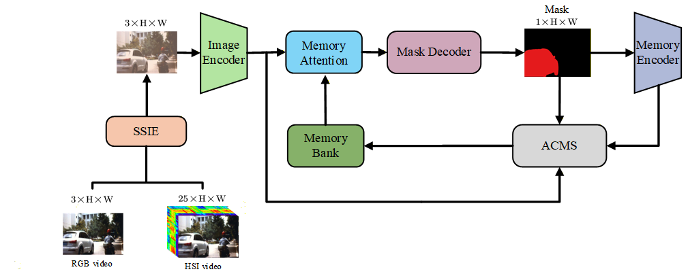
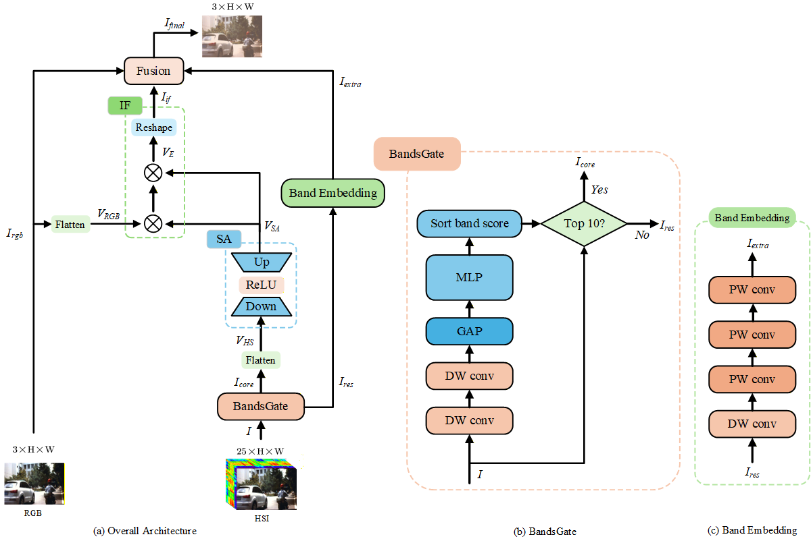
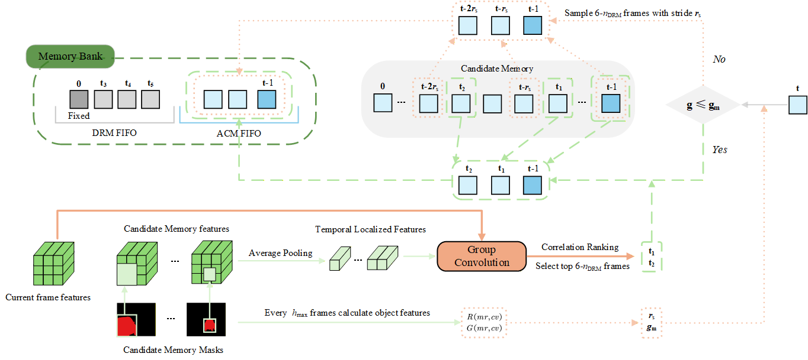

# SSAM‑SAM2

This is the code for **Hyperspectral Video Object Segmentation Based on Spectral–Spatial Interaction Enhancement and Adaptive Correlation Memory Selection**.

 
<em>[Please add your figure caption for overall network pipeline]</em>

 

 
<em>[Please add your figure caption for SSIE module]</em>

 

 
<em>[Please add your figure caption for ACMS module]</em>

> 📌 Note: The source code is currently under preparation for journal submission and will be publicly released upon acceptance.
